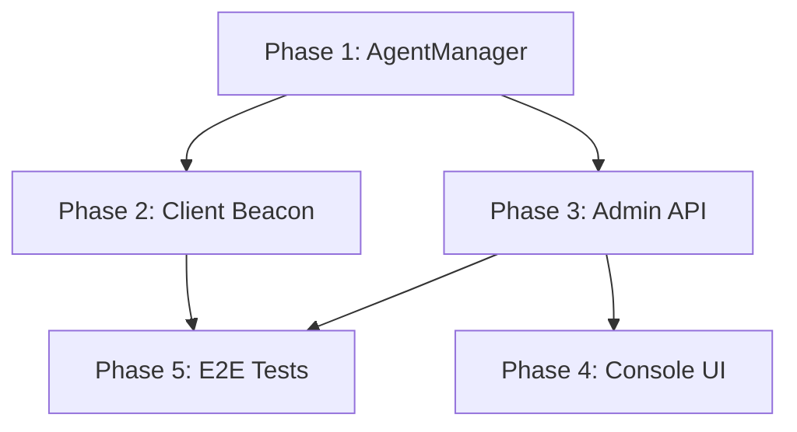

# Step 5: Implementation Plan & Next Actions

## ⚠️ ОБНОВЛЕНО: Учтён рефакторинг (2026-01-09)
План адаптирован под новую структуру проекта (`cmd/`, `internal/`).

## A. Prerequisites
- ✅ Рефакторинг завершён (см. `plans/2026-01-09_RevSocks_Refactor`)
- ✅ Новая структура: `cmd/{agent,server}/`, `internal/{agent,server,common,transport}/`
- ✅ E2E framework работает с новыми бинарниками

## B. Execution Order (Recommended)

### Phase 1: Server Core (2-3 часа)
**Goal:** AgentManager + Persistence + Handshake v3

**Tasks:**
1. Создать `internal/server/agent_manager.go`
   - Структуры `AgentConfig`, `AgentState`
   - Методы `Load/Save/RegisterAgent/UpdateConfig/ListAgents`
   - Thread-safety (RWMutex)

2. Обновить `internal/server/server.go`
   - Изменить `handleConnection` для handshake v3
   - Парсинг `AUTH <pass> <id> <version>`
   - Отправка `CMD TUNNEL | CMD SLEEP <sec> <jitter> | ERR <msg>`

3. Обновить `cmd/server/main.go`
   - Инициализация AgentManager
   - Флаги для `agents.json` path

**Verification:** Компиляция + unit tests для AgentManager

### Phase 2: Client Core (3-4 часа)
**Goal:** Beacon Loop + Jitter + Persistent ID

**Tasks:**
1. Обновить `internal/agent/client.go`
   - `loadOrGenerateAgentID()` (save to `~/.revsocks.id`)
   - `connectAndHandshake()` - отправка AUTH, парсинг ответа
   - `StartBeaconLoop()` - state machine (SLEEP/TUNNEL)
   - `calculateJitter()` - random sleep calculation

2. Обновить `cmd/agent/main.go`
   - Load Agent ID при старте
   - Вызов `agent.StartBeaconLoop()`

**Verification:** Компиляция + unit tests для Jitter/ID + manual test (agent <-> server)

### Phase 3: Admin API (2-3 часа)
**Goal:** HTTP REST API для управления агентами

**Tasks:**
1. Создать `internal/server/api.go`
   - `AdminServer` struct
   - Endpoints: `GET /api/agents`, `POST /api/agents/{id}/config`, `DELETE /api/sessions/{id}`
   - Auth middleware (X-Admin-Token)

2. Обновить `cmd/server/main.go`
   - Флаги: `-admin-api`, `-admin-port`, `-admin-token`
   - Запуск AdminServer в горутине

**Verification:** curl тесты для API endpoints

### Phase 4: Console UI (3-4 часа)
**Goal:** Python CLI (Grumble) для управления

**Tasks:**
1. Setup `tools/console/` project structure
   - `pyproject.toml` (Poetry Level 2)
   - Dependencies: `grumble`, `requests`, `rich`

2. Implement core modules
   - `core/api.py` - HTTP client wrapper
   - `commands/agents.py` - agent management commands
   - `main.py` - Grumble shell entrypoint

3. Commands implementation
   - `agents list` - table view
   - `agent sleep <id> <seconds>` - set sleep mode
   - `agent wake <id>` - set tunnel mode
   - `agent rename <id> <alias>` - set alias

**Verification:** Manual testing с реальным сервером

### Phase 5: Testing & Documentation (2-3 часа)
**Goal:** Comprehensive tests + updated docs

**Tasks:**
1. Unit tests
   - `internal/server/agent_manager_test.go`
   - `internal/agent/client_test.go`
   - `internal/server/api_test.go`

2. E2E tests
   - `tests/e2e/scenarios_test.go` - добавить beacon scenarios

3. Documentation
   - `docs/04_Features/BEACON_MODE.md` - полное описание
   - `README.md` - добавить beacon mode usage
   - `feature.md` - отметить выполненные задачи

**Verification:** `go test ./... -v` проходит все тесты

## C. Total Time Estimate
- **Phase 1:** 2-3 часа
- **Phase 2:** 3-4 часа
- **Phase 3:** 2-3 часа
- **Phase 4:** 3-4 часа
- **Phase 5:** 2-3 часа
- **Total:** 12-17 часов

## D. Critical Dependencies


## E. Risk Mitigation

### Risk 1: Handshake Protocol Breaking Changes
**Mitigation:** 
- Сохранить legacy режим (без beacon) как fallback
- Использовать версию протокола в handshake
- E2E тесты для обратной совместимости

### Risk 2: Agent ID Collision
**Mitigation:**
- UUID v4 для генерации ID (collision probability negligible)
- Server validation при регистрации

### Risk 3: Race Conditions в AgentManager
**Mitigation:**
- RWMutex для всех операций
- Unit тесты с `-race` флагом
- Atomic JSON save (write to temp + rename)

## F. Next Immediate Action

**START HERE:** Phase 1, Task 1 - Создать `internal/server/agent_manager.go`

```bash
cd Linux/MyCustomProjects/RevSocks_my/revsocks
# Создать файл с базовой структурой
touch internal/server/agent_manager.go
```

Refer to: `plans/2026-01-09_FEATURE_SLEEP_PLAN/01_Server_Architecture.md` для детального дизайна.
